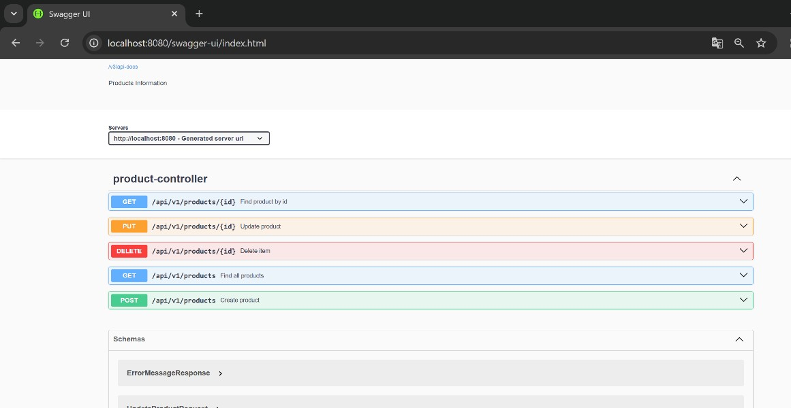
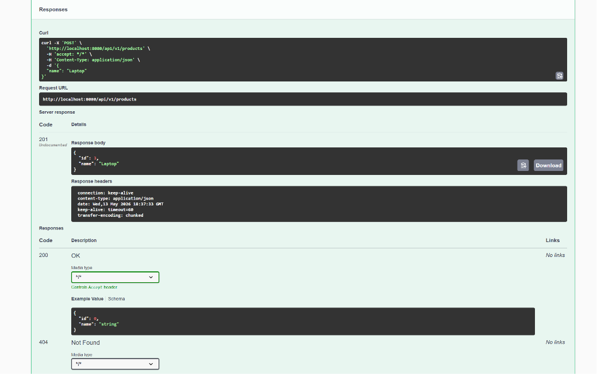
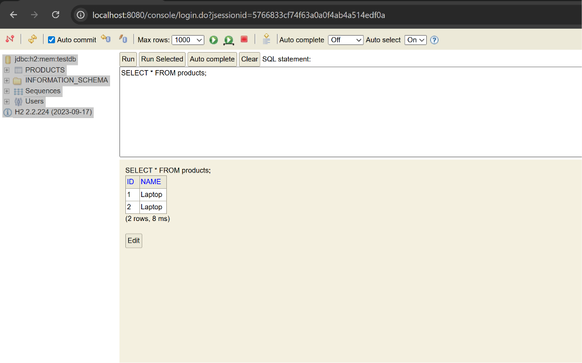

# First REST API Spring

Demo project for Spring Boot REST API with CRUD operations.

## Technologies

- Java 25
- Spring Boot 3.2.5
- Spring Data JPA
- H2 In-Memory Database
- Swagger UI (springdoc-openapi 2.5.0)

## How to Run

1. Open the project in IntelliJ IDEA
2. Run `FirstRestApiSpringApplication.java`
3. Open Swagger UI at `http://localhost:8080/swagger-ui/index.html`
4. Open H2 Console at `http://localhost:8080/console/` (JDBC URL: `jdbc:h2:mem:testdb`, User: `sa`, Password: empty)

## API Endpoints

| Method | URL | Description |
|--------|-----|-------------|
| `POST` | `/api/v1/products` | Create a product |
| `GET` | `/api/v1/products` | Get all products |
| `GET` | `/api/v1/products/{id}` | Get product by ID |
| `PUT` | `/api/v1/products/{id}` | Update product |
| `DELETE` | `/api/v1/products/{id}` | Delete product |

## Screenshots

### Swagger UI

### Create product (POST)

### H2 Database Console

